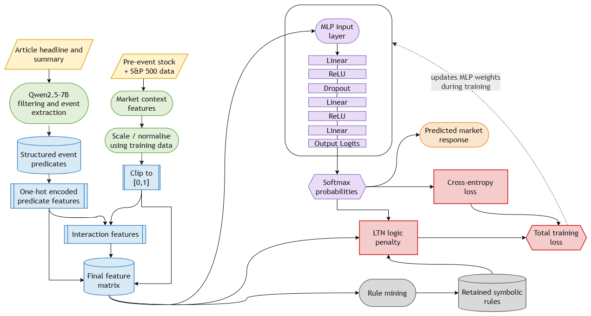

# Stock Sentiment Prediction

This repository investigates a neuro-symbolic pipeline for predicting
short-horizon stock returns from financial news headlines on the
"Magnificent Seven" (MAG7) US technology stocks: Apple, Amazon, Alphabet,
Meta, Microsoft, Nvidia, and Tesla.

Deep learning models that fuse news text with market data can predict
returns effectively, but they do so as black boxes, offering no insight
into which inputs actually drove a given prediction. This introduces a
problem in a domain where predictive signals are expected to come with
an auditable rationale. This project addresses that gap directly, rather
than scoring every headline as generically positive or negative:

1. An LLM (Qwen2.5-7B-Instruct) filters news down to firm-specific
   market-moving events, classifying each one against a fixed event
   taxonomy with a directional judgement and a self-reported confidence
   score.
2. These structured event labels are combined with market-context features
   (prior returns, volatility, news intensity) and fed into a softmax
   neural classifier trained jointly with a Logic Tensor Network (LTN),
   which penalizes predictions that violate symbolic rules mined from the
   training data, producing an inspectable rule set alongside each
   prediction.
3. The system is evaluated as a full three-class classifier (bullish /
   bearish / neutral) across every event, and as a selective classifier
   that abstains below a calibrated confidence threshold, across two
   chronological train/validation/test splits to check robustness.

```text
Alpha Vantage news
        -> local PostgreSQL archive
        -> cleaned article / ticker / topic tables
        -> Hugging Face dataset snapshot
        -> prompt selection (few-shot relevance judge)
        -> article-event label extraction (LLM classifier + leakage-safe event date)
        -> interaction model: article-event labels + market context + LTN rules
```



## Results

- The full three-class classifier does not beat a majority-class baseline
  on either chronological test split (49.4% vs. a 50.9% baseline on the
  primary split; 48.0% vs. 67.1% on the secondary split).
- The LTN's symbolic rule layer is statistically indistinguishable from an
  equivalent neural classifier trained without a logic penalty (within one
  standard deviation on accuracy and aligned mean return, both splits,
  10 seeds); most individually mined rules fail to generalize to test data.
- A selective classifier restricted to high-confidence (90th-percentile)
  bullish predictions produces a consistent positive result: 63-68%
  accuracy and 2.6-3.8% aligned mean return across both splits (bootstrap
  p ≤ 0.006), regardless of whether the logic penalty is applied.
- Conclusion: confidence-aware selective prediction is a more reliable
  lever than symbolic rule constraints in this setting.

## Data Availability

This repository contains everything needed to reproduce the pipeline end
to end. The underlying data itself is not published here, as doing so would
violate Alpha Vantage's terms of service.

- A PostgreSQL `news_sentiment` table is assumed to already exist. See
  [Reproducing The Pipeline](#reproducing-the-pipeline) for its schema,
  and for how to rebuild the dataset end-to-end and point the extraction
  script at your own Hugging Face repos.

## Repository Structure

```text
docs/
  architecture.png                            # interaction model architecture diagram, referenced above

data/
  pipeline/                                   # scripts used to collect, clean, and export the raw news data
    config.py                                 # environment variable loading
    collect_news_by_ticker.py                 # ticker-based Alpha Vantage news backfill
    backfill_news_windows.py                  # repair/backfill utility for missed windows
    build_clean_news_tables.py                # PostgreSQL -> cleaned article/ticker/topic tables
    transform_alpha_vantage.py                # shared Alpha Vantage transformation logic
    fetch_mag7_daily_prices.py                # MAG7 daily OHLCV via yfinance
    fetch_sp500_daily_prices.py                # S&P 500 daily OHLCV via yfinance, used as market context
  headline_filtering_manual_audit.csv         # manual audit set used by the prompt evaluator

scripts/
  n_shot_prompt_evaluation.py                 # 0-6 shot prompt selection for the relevance judge
  process_news.py                             # LLM article-event label extraction (production classifier)

notebooks/
  final_notebook.ipynb                        # final modelling notebook
  figures.ipynb                               # standalone figures for the write-up (hardcoded summary numbers, not a pipeline stage)
```

- `data/pipeline/` contains everything used to collect, clean, and export the
  raw data the study is built on.
- `scripts/` contains the two-stage LLM event-extraction pipeline, ran in a
  GPU environment. Each stage writes its own results to `outputs/` for
  provenance, generated locally rather than committed.
- `notebooks/` contains the final modelling notebook and the figures
  notebook. The modelling notebook writes its own results folder locally
  when run.

## Setup

```powershell
python -m venv .venv
.\.venv\Scripts\Activate.ps1
python -m pip install -e ".[notebooks]"
```

Copy `.env.example` to `.env` and fill in only the credentials needed for the
part of the pipeline you are running:

- `ALPHA_VANTAGE_API_KEY`: required for `data/pipeline/collect_news_by_ticker.py`
  and `backfill_news_windows.py`.
- `POSTGRES_PASS`: required for the same two scripts, plus
  `build_clean_news_tables.py`. Assumes a local PostgreSQL instance
  (`localhost:5432`, database `stock_market`, user `postgres`).
- `HF_TOKEN`: your own Hugging Face token, used to pull the
  Qwen2.5-7B-Instruct model weights and to read/write your own dataset
  repos. It does **not** grant access to the author's private news/price
  datasets. You need to rebuild those yourself from the collection
  scripts (see below) and push them to your own Hugging Face account.

## Reproducing The Pipeline

Every stage below has a script in this repo. The full end-to-end
reproduction is not a quick one-command run. The Alpha Vantage free tier's
rate limit means the news backfill in step 2 can take weeks of repeated
daily runs to build a comparable dataset. `yfinance` and the manual audit
set have no such constraint.

1. **Create the raw news table.** `collect_news_by_ticker.py` and
   `backfill_news_windows.py` both assume a PostgreSQL table matching
   the columns they insert:

   ```sql
   CREATE TABLE news_sentiment (
       id BIGSERIAL PRIMARY KEY,
       requested_entity TEXT,
       title TEXT,
       time_published TIMESTAMP,
       url TEXT UNIQUE,
       summary TEXT,
       source TEXT,
       overall_sentiment_score DOUBLE PRECISION,
       overall_sentiment_label TEXT,
       ticker_sentiment TEXT,
       topics TEXT
   );
   ```

2. **Collect news.** Run `data/pipeline/collect_news_by_ticker.py` repeatedly
   (it picks one MAG7/benchmark ticker per calendar day and resumes from a
   `checkpoint_<TICKER>.txt` file) to build up history within the free-tier
   rate limit. Use `backfill_news_windows.py` to fill in any gaps it reports.
3. **Fetch prices.** Run `fetch_mag7_daily_prices.py` and
   `fetch_sp500_daily_prices.py` (no rate limit), producing
   `data/mag7_daily_prices.parquet` and `data/sp500_daily_prices.parquet`
   directly.
4. **Export clean tables.** Run `build_clean_news_tables.py` to read the
   `news_sentiment` table and write monthly `hf_dataset/articles/*.parquet`,
   `hf_dataset/tickers/*.parquet`, and `hf_dataset/topics/*.parquet` files.
5. **Upload to your own Hugging Face account.** `scripts/process_news.py`
   reads news and prices from Hugging Face dataset repos, not local files
   (`NEWS_DATASET` and `PRICE_DATASET` constants near the top of the
   script). Push the `hf_dataset/articles/` output from step 4 and
   `mag7_daily_prices.parquet` from step 3 to your own HF dataset repos,
   and update those two constants to point at them.
6. **Select the relevance prompt.** Run `scripts/n_shot_prompt_evaluation.py`
   against `data/headline_filtering_manual_audit.csv` to compare 0- through
   6-shot prompt variants. This is informational: it justifies the two-shot
   prompt hardcoded into `process_news.py`'s `prompt()` function, but the two
   scripts are not wired together: `process_news.py` does not read
   `n_shot_prompt_evaluation.py`'s output.
7. **Extract article-event labels.** Run `scripts/process_news.py` (GPU
   required). It downloads the news/price data from the Hugging Face repos
   set up in step 5, classifies each ticker-article, maps kept events to a
   leakage-safe trading date, and writes `article_event_labels.parquet`.
8. **Run the modelling notebook.** Copy `article_event_labels.parquet`,
   `mag7_daily_prices.parquet`, and `sp500_daily_prices.parquet` into
   `notebooks/` (or point the notebook's `DATA_DIR`/file-name variables at
   `data/`), then run `notebooks/final_notebook.ipynb`. Results are written
   to `notebooks/FINAL_v3__17_mag7_article_event_label_interaction_clean_no_robust/`.
9. **Figures.** `notebooks/figures.ipynb` is self-contained. The numbers it
   plots are copied in from the modelling notebook's results, not read live,
   so it can be run independently of the steps above.

## License

MIT. See [LICENSE](LICENSE).
